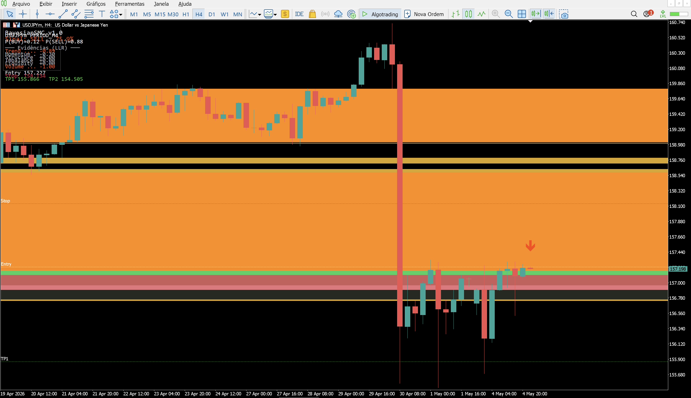

# Bayesian Smart Money Concepts — MT5

> Indicador preditivo para MetaTrader 5 que combina os conceitos de Smart Money (SMC) com inferência Bayesiana em log-odds para gerar probabilidades de compra e venda em tempo real, com sinais visuais, zonas de Order Block / FVG e níveis de entrada, stop e take-profit.

[]()
[]()
[]()
[]()
[](LICENSE)

---

## Sobre

**Bayesian SMC** é um indicador autocontido para MetaTrader 5 que olha para o gráfico através de seis lentes diferentes — tendência, momentum, estrutura de mercado, imbalance, varredura de liquidez e volume — e combina essas evidências usando inferência Bayesiana em log-odds para produzir uma probabilidade conjunta de compra e venda.

A ideia é simples: em vez de regras determinísticas do tipo "se RSI < 30 então compre", o indicador trata cada sinal como uma evidência probabilística. Cada evidência empurra a probabilidade para cima ou para baixo, e a saída final é uma estimativa contínua de P(BUY) e P(SELL) calibrada por pesos configuráveis.

---

## Capturas de tela



_Indicador rodando em USDJPY H4. Painel superior mostra as probabilidades em tempo real (`P(BUY)=0.12 | P(SELL)=0.88`), as seis evidências individuais (Trend, Momentum, Structure, Imbalance, Liquidity, Volume) em log-likelihood ratio (LLR) e os níveis de Entry/Stop/TP. As zonas laranja são FVGs (Fair Value Gaps); a linha branca é o Entry; verdes são TP1/TP2; vermelha é o Stop._

---

## Recursos

### Inferência Bayesiana
- **Log-odds aditivo** para combinar evidências independentes
- **Pesos configuráveis** para cada uma das 6 evidências
- **Probabilidade calibrada** P(BUY) e P(SELL) saem como porcentagem direta
- **Filtro por confiança mínima** — só emite sinal acima de um threshold (default 60%)

### As 6 evidências
1. **Trend** — EMA rápida vs EMA lenta (default 20/50)
2. **Momentum** — RSI 14 com pivôs 30/70
3. **Structure** — quebras de estrutura (BoS) e mudanças de caráter (CHoCH) detectadas via fractais
4. **Imbalance** — Fair Value Gaps (FVG) automaticamente identificados
5. **Liquidity** — varreduras de liquidez (sweeps) sobre máximas/mínimas anteriores
6. **Volume** — volume confirmatório acima da média

### Sinais e níveis
- **Setas de compra/venda** plotadas no momento do disparo
- **Linhas horizontais** automáticas: Entry, Stop, TP1, TP2
- **Stop** dimensionado por ATR (default 1.5×)
- **Take-profits** baseados em risco-retorno (TP1 1.5R, TP2 3.0R, configuráveis)

### Zonas plotadas
- **Order Blocks (OB)** bullish (verde) e bearish (vermelho)
- **Fair Value Gaps (FVG)** bullish (dourado) e bearish (laranja)
- Limite configurável de zonas simultâneas (default 8) para não poluir o gráfico

### Painel Bayesiano em tempo real
Painel no canto do gráfico mostrando:
- **P(BUY)** e **P(SELL)** em tempo real
- **Cada evidência** individual em LLR
- **Entry, Stop, TP1 e TP2** propostos
- Atualizado a cada barra

---

## Instalação

1. Faça download do arquivo [`BayesianSMC.mq5`](BayesianSMC.mq5).
2. No MetaTrader 5, abra **Arquivo → Abrir Pasta de Dados**.
3. Copie o arquivo `.mq5` para `MQL5/Indicators/`.
4. Na janela **Navegador** do MT5, clique direito em **Indicadores → Atualizar**.
5. Arraste **BayesianSMC** para o gráfico desejado.

> **Compilação:** se o indicador não aparecer compilado, abra-o no MetaEditor (F4 no MT5) e pressione **F7** para compilar.

> **Standalone:** o indicador é totalmente autocontido — nenhuma dependência de includes externos, libraries ou outros arquivos.

---

## Parâmetros principais

### Engine
| Parâmetro | Default | Descrição |
|---|---|---|
| `InpLookbackBars` | 300 | Barras analisadas (mínimo 100) |
| `InpSwingStrength` | 3 | Força do fractal para detectar swings (mínimo 2) |
| `InpMinConfidence` | 60.0 | Confiança mínima (%) para gerar sinal |
| `InpEMA_Fast` / `InpEMA_Slow` | 20 / 50 | EMAs para tendência |
| `InpRSI_Period` | 14 | Período do RSI |
| `InpATR_Period` | 14 | Período do ATR (stop/target) |
| `InpVolumeMA` | 20 | Período da MA do volume |

### Pesos Bayesianos
Cada evidência tem um peso configurável que determina seu impacto na probabilidade final:

| Evidência | Peso default |
|---|---|
| Trend (EMA fast vs slow) | 1.0 |
| Momentum (RSI) | 1.0 |
| Structure (BoS/CHoCH) | **1.3** |
| Imbalance (FVG) | **1.1** |
| Liquidity (sweeps) | **1.2** |
| Volume | 0.8 |

> Estrutura, liquidez e imbalance recebem peso maior por serem sinais mais raros e geralmente mais confiáveis. Volume tem peso menor porque é confirmatório, não preditivo.

### Risco
| Parâmetro | Default | Descrição |
|---|---|---|
| `InpATRMultStop` | 1.5 | Multiplicador de ATR para o stop |
| `InpRR_TP1` | 1.5 | Risco-retorno do TP1 |
| `InpRR_TP2` | 3.0 | Risco-retorno do TP2 |

### Visual
| Parâmetro | Default | Descrição |
|---|---|---|
| `InpShowArrows` | true | Setas de compra/venda |
| `InpShowEntryLines` | true | Linhas de Entry/Stop/TP |
| `InpShowZones` | true | Zonas OB e FVG |
| `InpShowPanel` | true | Painel Bayesiano |
| `InpMaxZones` | 8 | Máximo de zonas simultâneas |

---

## Como funciona

```
Preço + Volume + Tempo
        │
        ▼
┌──────────────────────────┐
│ Extrai 6 evidências      │
│   1. Trend (EMA cross)   │
│   2. Momentum (RSI)      │
│   3. Structure (BoS)     │
│   4. Imbalance (FVG)     │
│   5. Liquidity (sweep)   │
│   6. Volume vs MA        │
└──────────────────────────┘
        │
        ▼
┌──────────────────────────┐
│ Cada evidência vira LLR  │  ◄── log(P(E|BUY) / P(E|SELL))
└──────────────────────────┘
        │
        ▼
┌──────────────────────────┐
│ Soma ponderada dos LLRs  │  ◄── pesos configuráveis
└──────────────────────────┘
        │
        ▼
┌──────────────────────────┐
│ Sigmoid → P(BUY), P(SELL)│
└──────────────────────────┘
        │
        ├── P(BUY) ≥ confiança mín. ──► seta BUY + Entry/Stop/TP
        │
        └── P(SELL) ≥ confiança mín. ──► seta SELL + Entry/Stop/TP
```

### Por que Bayesiano?

A grande vantagem da abordagem Bayesiana é que evidências independentes podem ser **combinadas linearmente em log-odds** sem ter que modelar dependências complexas. Em outras palavras:

$$\log\left(\frac{P(\text{BUY}|E)}{P(\text{SELL}|E)}\right) = \sum_{i} w_i \cdot \text{LLR}_i$$

onde $\text{LLR}_i$ é o log-likelihood ratio da evidência $i$ e $w_i$ é o peso configurável. Aplicando o sigmóide na soma final, recuperamos a probabilidade calibrada.

Isso resolve um problema clássico de indicadores compostos: **somar sinais de naturezas diferentes sem distorcer a calibração**.

---

## Aviso

Este indicador foi desenvolvido para fins **educacionais e de estudo**. Não constitui recomendação de investimento e não garante resultados financeiros. Operações no mercado financeiro envolvem risco de perda. Use em conta demo antes de qualquer aplicação em conta real, e nunca arrisque mais do que pode perder.

---

## Licença

Distribuído sob a [Licença MIT](LICENSE).

---

## Autor

**Hugo Pereira de Sousa**

Estudante de Ciência de Dados e Inteligência Artificial — IESB (Brasília-DF). Foco em análise de dados, IA aplicada e indicadores quantitativos para mercado financeiro.

- LinkedIn: [hugo-sousa-901b2b342](https://www.linkedin.com/in/hugo-sousa-901b2b342)
- GitHub: [@hugopsousa-dev](https://github.com/hugopsousa-dev)
